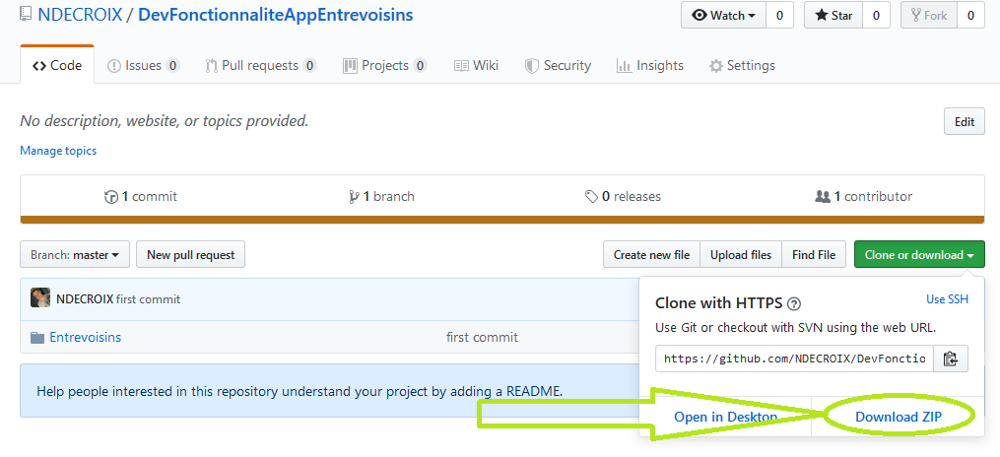
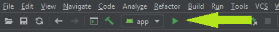
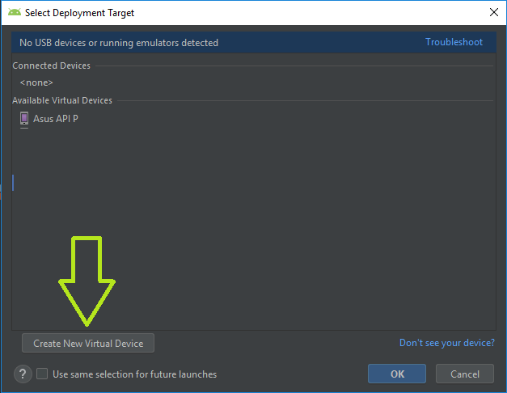
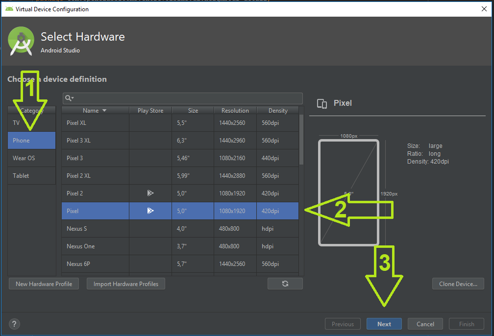
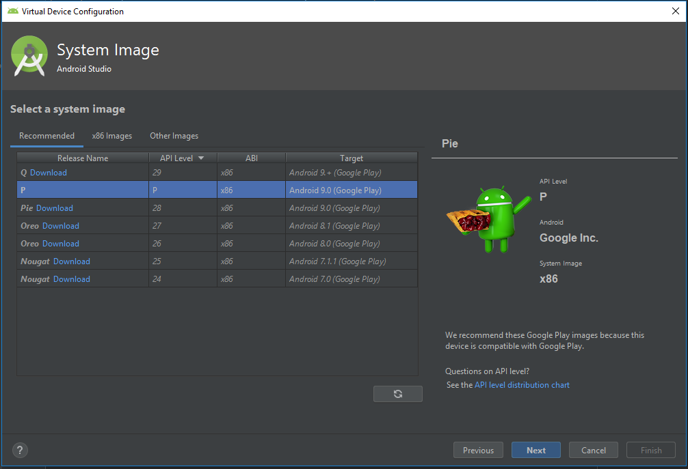
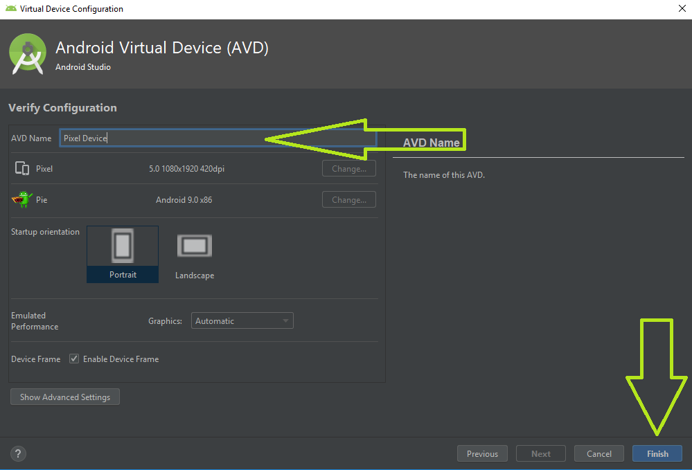
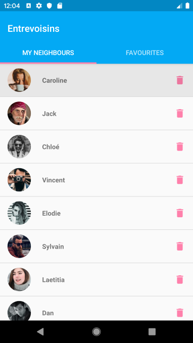

# Entrevoisins

## Installation

Pour exécuter et compiler l’application veuillez suivre les étapes suivantes :

```
Télécharger L'application
```
[]()

```
Ouvrir le projet avec Android Studio
```
```
Lancer l'application sur l'émulateur
```
[]()

Si vous disposez déjà d'un appareil virtuel vous pouvez directement lancer l'application sinon veuillez suivre 
les étapes de creation d'un appareil virtuel :

```
Créer un appareil virtuel
```
[]()

```
Choisir un appareil dans la catégorie phone
```
[]()

```
Choisir une image
```
[]()

Vous pouvez être amené à devoir télécharger l'image si vous ne l'avez pas déjà fait.

```
Changez le nom si besoin et cliquez sur finish
```
[]()

```
Vous pouvez maintenant lancer l'application sur l'émulateur et voir l'écrant suivant apparaître
```
[]()
