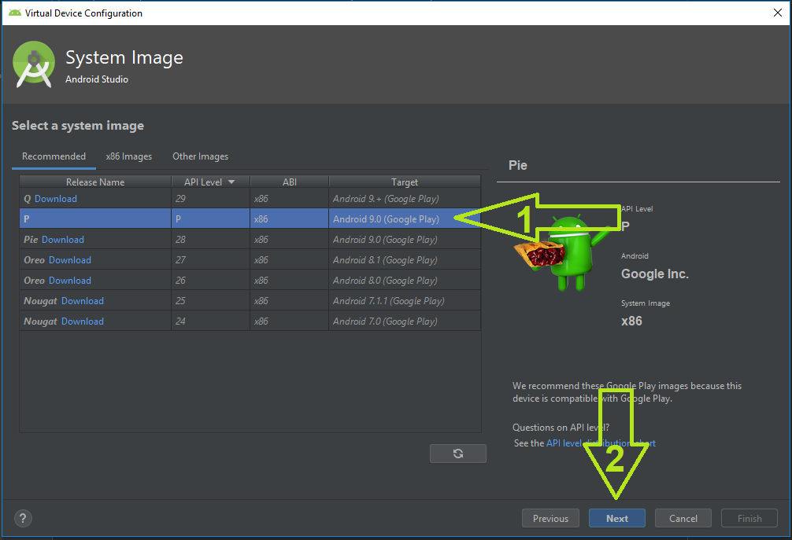

# Entrevoisins

## Installation

```
Télécharger L'application
```
[]()

```
Ouvrir le fichier avec AndroidStudio
```
```
Lancer l'application sur l'émulateur
```
[]()

```
Créer un appareil virtuel
```
[]()

```
Choisir un appareil
```
[]()

```
Choisir une image
```
[]()

```
Changez le nom si besoin et cliquez sur finish
```
[]()

```
Vous pouvez maintenant lancer l'appareil virtuel
```

